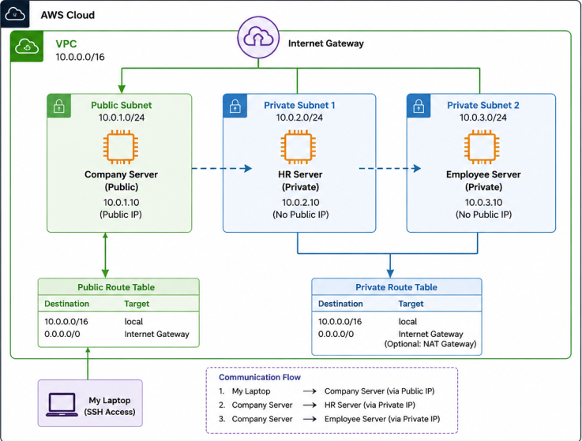

# 🏗️ Architecture Diagram

This folder contains the architecture diagram for the **AWS Company Network Architecture** project.

## Architecture Overview

The project consists of:

- 1 Custom Amazon VPC
- 1 Public Subnet
- 2 Private Subnets
- Internet Gateway
- Route Tables
- Security Groups
- 3 Ubuntu EC2 Instances

### EC2 Instances

- 🖥️ Company Server (Public)
- 🖥️ HR Server (Private)
- 🖥️ Employee Server (Private)

## Communication Flow

```
Internet
      │
Internet Gateway
      │
Public Subnet
      │
Company Server
      │
──────── Private Network ────────
      │                 │
HR Server         Employee Server
```

The Company Server acts as the secure entry point to access the private servers.

The HR and Employee servers are deployed inside private subnets and are **not directly accessible from the Internet**.

# 🏗️ AWS Network Architecture

This diagram illustrates the complete AWS networking architecture used in this project.



## Components

- Amazon VPC (10.0.0.0/16)
- Public Subnet
- Private Subnet 1 (HR)
- Private Subnet 2 (Employee)
- Internet Gateway
- NAT Gateway
- Route Tables
- Security Groups
- Company, HR, and Employee EC2 Instances
