# 📸 Project Screenshots

This folder contains screenshots demonstrating the complete implementation and testing of the **AWS Secure Company Network Architecture** project.

---

# 1️⃣ VPC Configuration

This screenshot shows the custom VPC created for the project.

- VPC CIDR: **10.0.0.0/16**
- DNS Resolution Enabled
- Custom Networking Environment

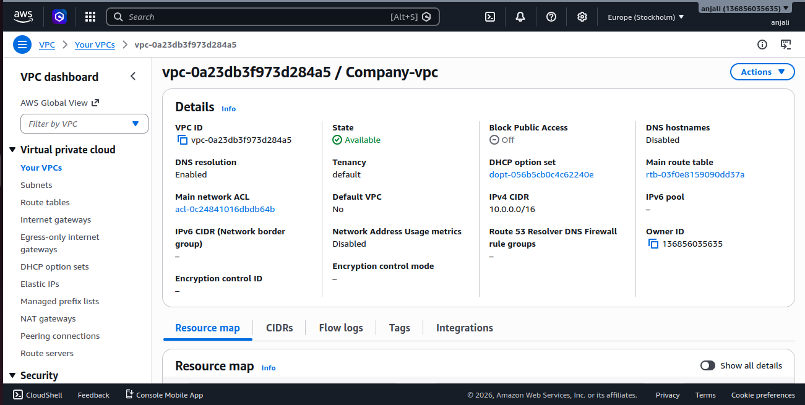

---

# 2️⃣ Private Route Table

The private route table is associated with the HR and Employee private subnets.

Routes:

- 10.0.0.0/16 → Local
- 0.0.0.0/0 → NAT Gateway


---

# 3️⃣ Public Route Table

The public route table is associated with the Company public subnet.

Routes:

- 10.0.0.0/16 → Local
- 0.0.0.0/0 → Internet Gateway


---

# 4️⃣ Company Security Group

Security Group attached to the Company Server.

Inbound Rules:

- SSH (22)
- Custom TCP 8000 (only when required)

Purpose:

- SSH access from laptop
- Communication with private servers

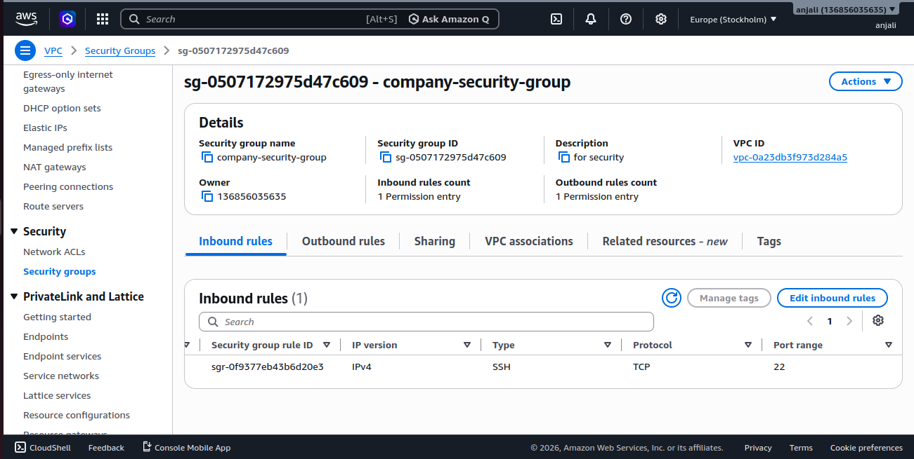

---

# 5️⃣ HR Security Group

Security Group attached to the HR Server.

Inbound Rules:

- SSH (22)
- Custom TCP 8000

Purpose:

- Receive requests only from Company Server.

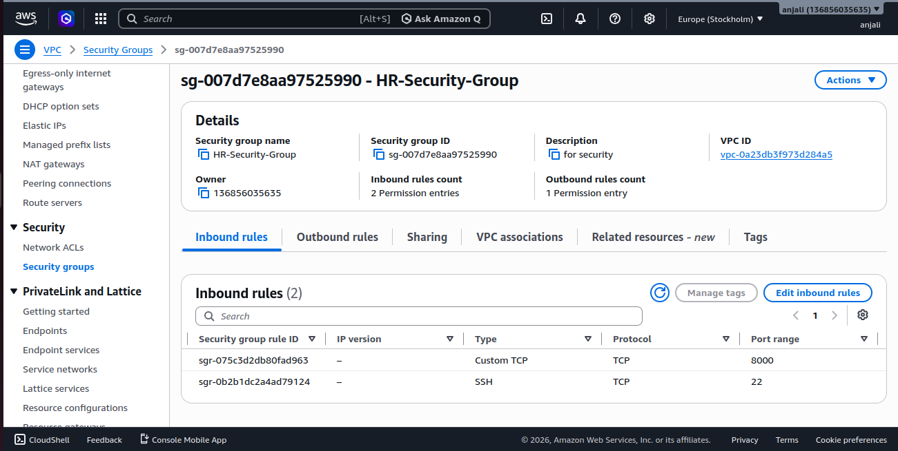

---

# 6️⃣ Employee Security Group

Security Group attached to the Employee Server.

Inbound Rules:

- SSH (22)
- Custom TCP 8000

Purpose:

- Receive requests only from Company Server.

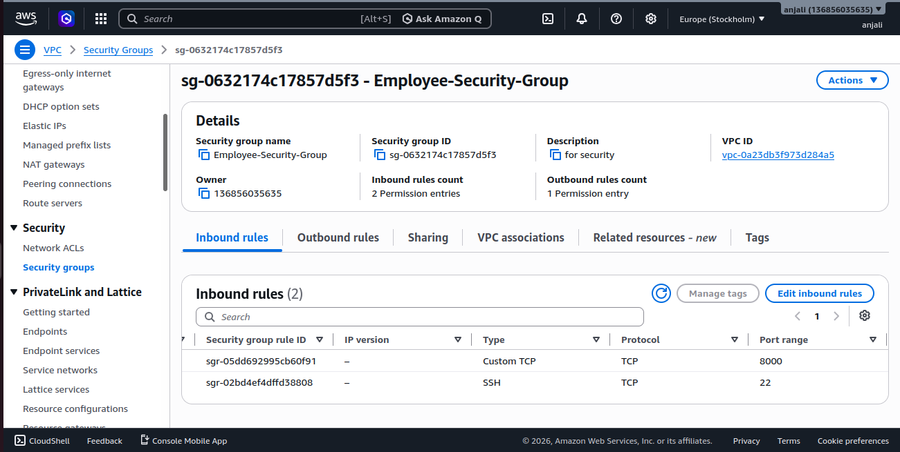

---

# 7️⃣ EC2 Instances

Three EC2 instances were launched.

| Server | Public IP | Private IP |
|---------|-----------|------------|
| Company Server | Yes | 10.0.1.81 |
| HR Server | No | 10.0.2.188 |
| Employee Server | No | 10.0.3.99 |

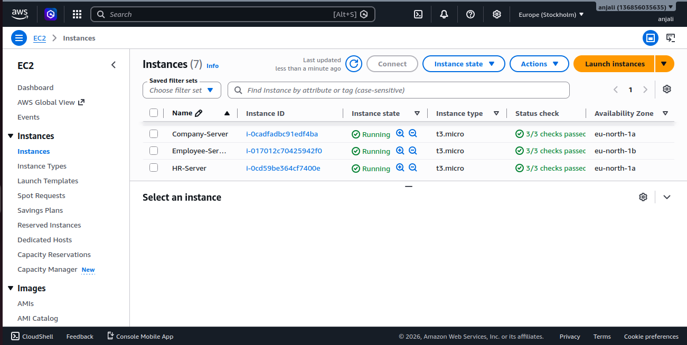

---

# 8️⃣ SSH Connection to Company Server

Successfully connected to the Company Server using its Public IP.

```bash
ssh -i aws_login.pem ubuntu@<Company-Public-IP>
```

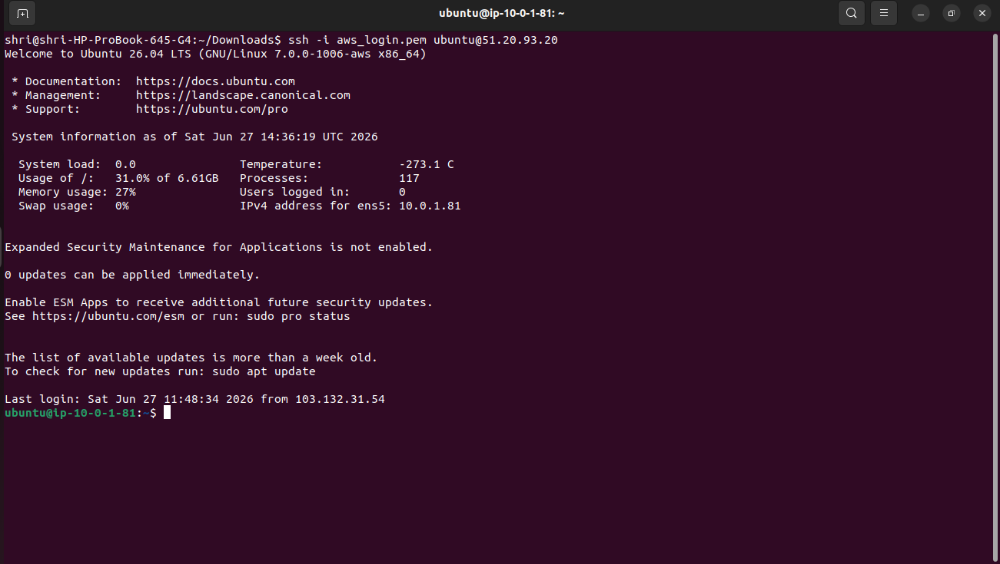

---

# 9️⃣ SSH Connection to Employee Server

Successfully connected to the Employee Server using the Company Server as a Bastion Host.

```bash
ssh -i aws_login.pem ubuntu@10.0.3.99
```

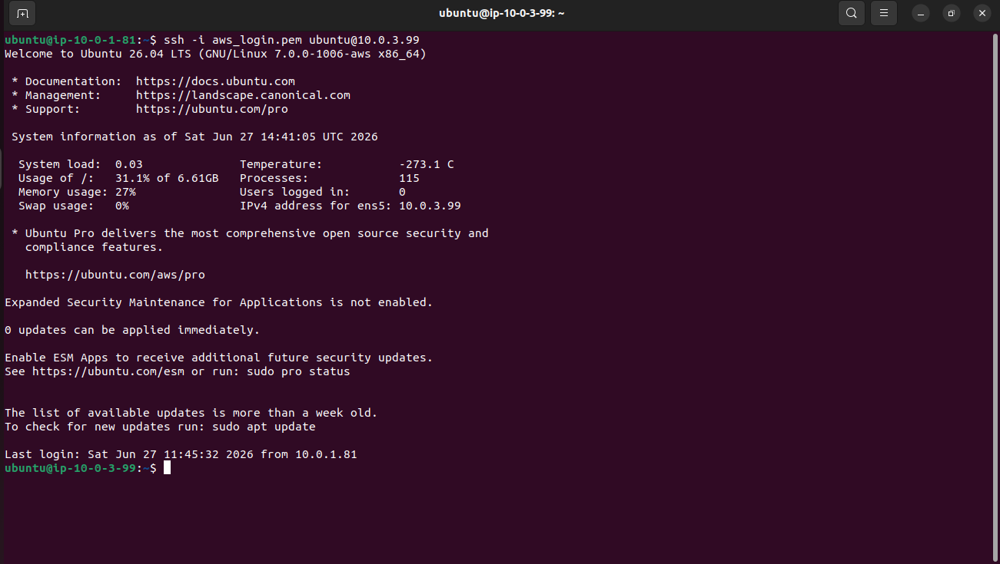

---

# 🔟 Python HTTP Server Running on HR Server

Started a simple Python web server on the HR Server.

```bash
python3 -m http.server 8000
```

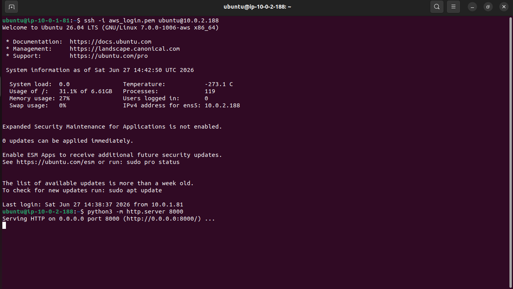

---

# 1️⃣1️⃣ Company Server Accessing HR Server

Verified communication between Company Server and HR Server using curl.

```bash
curl http://10.0.2.188:8000
```

Output:

```
This is HR Server
```

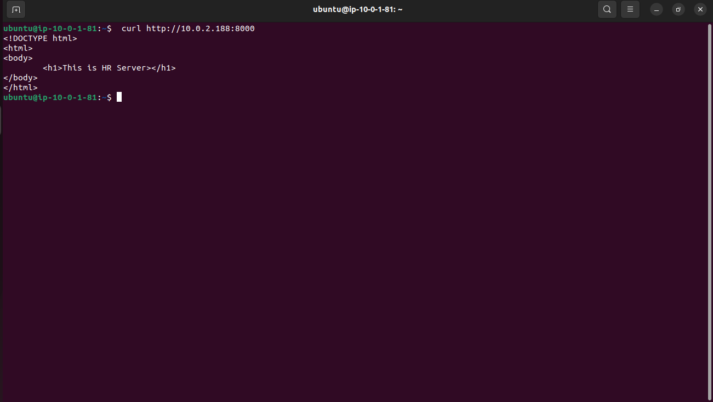

---

# 1️⃣2️⃣ Python HTTP Server Running on Employee Server

Started a Python web server on the Employee Server.

```bash
python3 -m http.server 8000
```

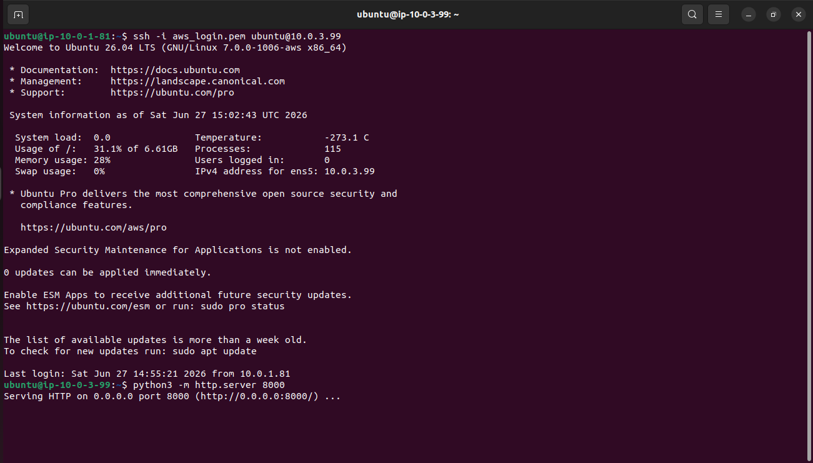

---

# 1️⃣3️⃣ Company Server Accessing Employee Server

Verified communication between Company Server and Employee Server.

```bash
curl http://10.0.3.99:8000
```

Output:

```
This is EMPLOYEE Server
```

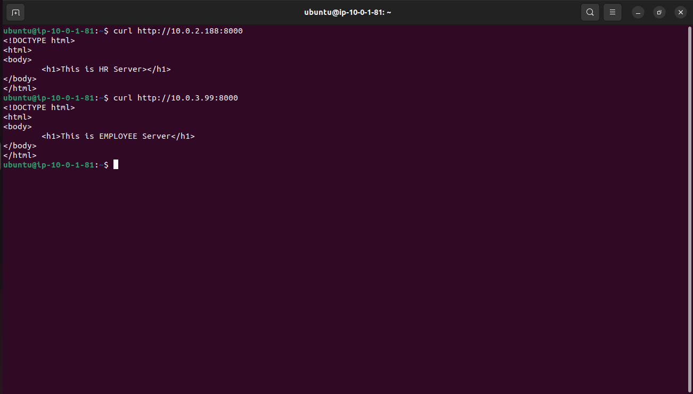

---

# 1️⃣4️⃣ SSH Connection to HR Server

Successfully connected to the HR Server from the Company Server using the private IP.

```bash
ssh -i aws_login.pem ubuntu@10.0.2.188
```

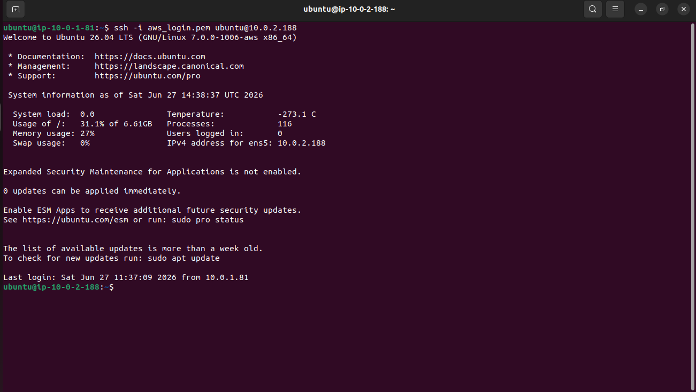

---

# ✅ Project Verification

The screenshots verify that:

- ✅ Custom VPC created
- ✅ Public Subnet configured
- ✅ Two Private Subnets configured
- ✅ Internet Gateway attached
- ✅ NAT Gateway configured
- ✅ Public Route Table configured
- ✅ Private Route Table configured
- ✅ Company Security Group configured
- ✅ HR Security Group configured
- ✅ Employee Security Group configured
- ✅ Three EC2 Instances launched
- ✅ SSH connectivity established
- ✅ Python HTTP Server running successfully
- ✅ Company Server communicates with HR Server
- ✅ Company Server communicates with Employee Server
- ✅ Private networking successfully implemented

---

# 🎯 Project Outcome

This project demonstrates a secure AWS networking architecture where:

- The Company Server is publicly accessible.
- HR and Employee Servers remain private.
- Internal communication is performed securely using private IP addresses.
- Security Groups restrict unnecessary access.
- Route Tables control traffic flow.
- Python HTTP Server is used to verify successful communication between instances.

This architecture closely resembles how real organizations securely deploy workloads on AWS.

---

# 👩‍💻 Author

**Anjali Gawali**

Computer Engineering Student

AWS | Linux | Networking | Cloud Computing

- 💼 LinkedIn: https://www.linkedin.com/in/anjali-gawali-248b2a399/
- 💻 GitHub: https://github.com/anjaligawali37
---
